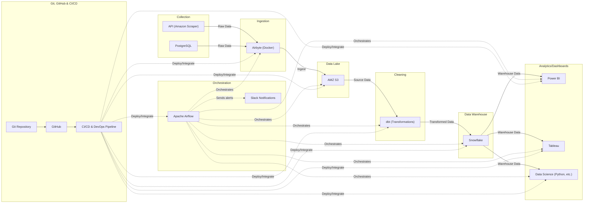

# veracitypro-data-pipeline-and-analytics-framework
Senior capstone project building a cloud-based data pipeline and analytics framework for VeracityPro. VeracityPro is a startup brand focused on designing and selling pickleball paddles through Amazon FBA, with an emphasis on community-building and data-driven decision making.

**Goal:** Scrapers/DB/API → Airbyte → S3 → Snowflake → dbt → Airflow → BI (Power BI/Tableau/Data Science).
<<<<<<< HEAD

**Status:** Week 4 - dbt setup
**Owner:** Christian Suarez
=======
**Status:** Week 3 – Snowflake Setup and Configuration.  
**Owner:** Christian Suarez 
>>>>>>> 323be4322f45b1ca81088ec8584053dcfad4c494

## Architecture

API -->|Raw Data| Airbyte
  PG -->|Raw Data| Airbyte
  Airbyte -->|Ingest| S3
  S3 -->|Source Data| DBT
  DBT -->|Transformed Data| Snowflake
  Snowflake -->|Warehouse Data| PowerBI & Tableau & DS

  Airflow -. Orchestrates .-> Airbyte & S3 & DBT & Snowflake & PowerBI & Tableau & DS
  Airflow -. Sends alerts .-> Slack

  Git --> GitHub --> CICD
  CICD -. Deploy/Integrate .-> Airbyte & DBT & Snowflake & Airflow & PowerBI & Tableau & DS & S3
