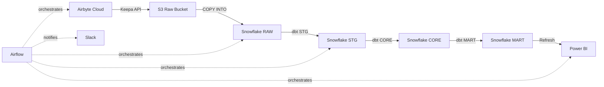

# Implementation Summary: Astro + Cosmos + dbt Pipeline

## **What Was Implemented**

This implementation provides a **production-ready, cloud-native ELT pipeline** for VeracityPro on Astronomer (Astro) using:
- **Apache Airflow** for orchestration
- **Airbyte Cloud** for data ingestion (Keepa → S3)
- **AWS S3** as data lake
- **Snowflake** as data warehouse (RAW → STG → CORE → MART)
- **dbt Core** for transformations (via astronomer-cosmos)
- **Slack** for notifications
- **Power BI** (placeholder for future integration)

---

## **Files Created/Modified**

### **1. Airflow DAGs**
- ✅ `airflow/dags/vp_daily_batch.py` - **Complete production DAG**
  - Triggers Airbyte sync
  - Waits for completion
  - Verifies S3 data arrival
  - Runs Snowflake COPY INTO
  - Executes dbt via Cosmos (auto-generates 30+ tasks)
  - Sends Slack notifications
  - Includes Power BI placeholder

### **2. Airflow Plugins**
- ✅ `airflow/plugins/slack_notifier.py` - **Slack message formatters**
  - Start/success/failure message templates
  - dbt summary formatting
  - Error truncation

### **3. dbt Configuration**
- ✅ `dbt/veracitypro_dbt/dbt_project.yml` - **Fixed naming and schema references**
  - Changed project name from `veracitypro_keepa` → `veracitypro_dbt`
  - Fixed schema references: `MARTS` → `MART`, `MONITOR` → `MONITORING`
  - Aligned with Snowflake infrastructure

- ✅ `dbt/veracitypro_dbt/profiles.yml` - **Production-ready profiles**
  - Reads credentials from environment variables (set by Cosmos)
  - Supports password or private key authentication
  - Configured for `VP_DWH` database, `STG` base schema

### **4. Python Dependencies**
- ✅ `docker/requirements-pipeline.txt` - **Complete Airflow + Cosmos dependencies**
  - All required Airflow providers (Snowflake, AWS, Airbyte, Slack, HTTP)
  - `astronomer-cosmos>=1.5.0`
  - `dbt-core>=1.7.0,<2.0.0`
  - `dbt-snowflake>=1.7.0,<2.0.0`
  - Data processing libraries (pandas, boto3, etc.)

### **5. Documentation**
- ✅ `docs/ideal_file_structure.md` - **Project structure guide**
  - Explains directory layout
  - Required vs. optional files
  - Deployment process
  - Best practices

- ✅ `docs/astro_cosmos_setup_guide.md` - **Cosmos integration guide**
  - How Cosmos works
  - Configuration options
  - Environment variables
  - Troubleshooting

- ✅ `docs/deployment_checklist.md` - **Pre-deployment checklist**
  - 13-step verification process
  - Snowflake, AWS, Airbyte, dbt, Airflow setup
  - Connection configuration
  - Testing procedures

- ✅ `docs/IMPLEMENTATION_SUMMARY.md` - **This file**

---

## **Pipeline Flow**



### **Detailed Task Flow**
```
1. notify_start
2. slack_notify_start
3. airbyte_trigger_keepa_sync
4. airbyte_wait_for_sync
5. s3_verify_keepa_data
6. snowflake_copy_into_raw
7. dbt_transform (expands to ~30 tasks)
   ├── dbt_transform.stg_keepa_price
   ├── dbt_transform.stg_keepa_rank
   ├── dbt_transform.stg_keepa_reviews
   ├── dbt_transform.core_keepa_price_daily
   ├── dbt_transform.core_keepa_rank_daily
   ├── dbt_transform.fct_price_history_daily
   ├── dbt_transform.dim_product
   └── ... (all other models)
8. powerbi_refresh_placeholder
9. prepare_success_summary
10. slack_notify_success

(If any task fails: slack_notify_failure)
```

---

## **Key Features**

### **✅ Idempotency**
- Snowflake COPY INTO uses `ON_ERROR = 'CONTINUE'`
- dbt models use `materialized='incremental'`
- Tasks safe to re-run without duplication

### **✅ Error Handling**
- 2 retries with 5-minute delay
- Slack notifications on failure with error details
- Failure task triggers on ANY upstream failure

### **✅ Observability**
- Slack start/success notifications
- dbt test results in `VP_DWH.MONITORING` schema
- Airflow task logs include full dbt output

### **✅ Scalability**
- dbt models run in parallel (Cosmos respects dependencies)
- Optional worker queue routing (`queue: "dbt"`)
- Incremental models prevent full-table scans

### **✅ Security**
- No hard-coded secrets
- All credentials via Airflow connections
- Snowflake role-based access control (RBAC)

---

## **Configuration Required**

### **1. Airflow Connections (in Astro UI)**
| Connection ID       | Type      | Purpose                          |
|---------------------|-----------|----------------------------------|
| `vp_snowflake`      | Snowflake | dbt and SnowflakeOperator access |
| `airbyte_cloud`     | HTTP      | Airbyte API authentication       |
| `aws_default`       | AWS       | S3 bucket access                 |
| `vp_slack_webhook`  | HTTP      | Slack notifications              |

### **2. Environment Variables (in Astro UI)**
| Variable                      | Value                          |
|-------------------------------|--------------------------------|
| `AIRBYTE_KEEPA_CONNECTION_ID` | `<your-airbyte-connection-id>` |
| `AS_OF_DATE`                  | `auto` (or specific date)      |

### **3. Snowflake Infrastructure**
Run SQL scripts in order:
1. `infra/snowflake/00_roles_users.sql`
2. `infra/snowflake/01_db_schemas.sql`
3. `infra/snowflake/02_warehouses.sql`
4. `infra/snowflake/03_stages_file_formats.sql`
5. `infra/snowflake/04_grants.sql`

---

## **Testing the Pipeline**

### **1. Local Validation**
```bash
# Validate dbt project
cd dbt/veracitypro_dbt
dbt compile --profiles-dir . --target prod

# Test DAG syntax
airflow dags test vp_daily_batch 2024-01-01
```

### **2. Deploy to Astro**
```bash
# Push to GitHub (triggers Astro deploy)
git add .
git commit -m "feat: implement Astro + Cosmos + dbt pipeline"
git push origin main
```

### **3. Manual Trigger**
1. Open Astro Airflow UI
2. Find `vp_daily_batch` DAG
3. Click "Trigger DAG"
4. Monitor task progress
5. Check Slack for notifications

---

## **Next Steps**

### **Immediate**
1. ✅ Set `AIRBYTE_KEEPA_CONNECTION_ID` environment variable
2. ✅ Configure all 4 Airflow connections
3. ✅ Run Snowflake infrastructure scripts
4. ✅ Test Airbyte connection (trigger manual sync)
5. ✅ Deploy to Astro and trigger DAG

### **Short-Term**
1. Add Power BI dataset refresh (replace placeholder)
2. Implement Snowflake Streams for CDC
3. Add SLAs to critical tasks
4. Create alerting for dbt test failures
5. Set up data quality monitoring dashboard

### **Long-Term**
1. Add more data sources (ScraperAPI, SP-API)
2. Implement data lineage tracking (via dbt docs)
3. Add CI/CD tests (pytest for DAGs, dbt tests)
4. Create separate `vp-prod` and `vp-dev` Astro deployments
5. Implement blue/green deployments for dbt models

---

## **Architecture Decisions**

### **Why Cosmos?**
- Native Airflow execution (no Docker/K8s overhead)
- Automatic task generation from dbt models
- Reuses Airflow connections (no separate credential management)
- Better observability (task-level logs, not container logs)

### **Why Snowflake COPY vs. Airbyte Direct Load?**
- More control over ingestion (COPY options, error handling)
- Leverage Snowflake's native S3 integration (faster, cheaper)
- Airbyte → S3 provides audit trail (raw data in S3)
- Easy to backfill (re-run COPY on historical S3 data)

### **Why RAW → STG → CORE → MART?**
- **RAW**: Immutable source-of-truth (exactly as ingested)
- **STG**: Type casting, renaming, basic cleaning
- **CORE**: Business logic, deduplication, joins
- **MART**: Denormalized, aggregated tables for BI

This layering ensures:
- Easy debugging (can inspect each layer)
- Reusable transformations (CORE used by multiple MARTs)
- Fast BI queries (MART pre-aggregated)

---

## **Maintenance**

### **Daily**
- Check Slack for failure notifications
- Monitor Airflow UI for stuck tasks

### **Weekly**
- Review dbt test failures in `VP_DWH.MONITORING`
- Check Snowflake query performance (slow models)
- Verify S3 bucket costs (prune old files if needed)

### **Monthly**
- Update Python dependencies (`requirements-pipeline.txt`)
- Review dbt model freshness
- Audit Snowflake warehouse usage (resize if needed)

---

## **Support**

- **Pipeline Issues**: Check `docs/deployment_checklist.md` → Troubleshooting
- **Cosmos Issues**: [GitHub Issues](https://github.com/astronomer/astronomer-cosmos/issues)
- **Astro Issues**: [support@astronomer.io](mailto:support@astronomer.io)
- **dbt Issues**: [dbt Community Slack](https://www.getdbt.com/community/)

---

**Implementation Date**: January 2025
**Status**: ✅ Complete - Ready for Deployment
**Owner**: Christian Suarez
